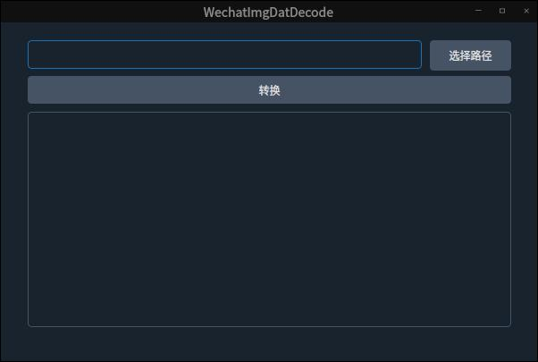

# wechatDatDecoderQtMain
wechat Dat文件解密并提供可视化界面

## 使用步骤
1、安装依赖：pip install requirements.txt

2、执行文件: python src/main.py

3、点击选择路径按钮，选择一个文件夹，本工具可以对该文件夹下的全部dat文件转换为img图片，并区分人像和非人像

## 效果截图

## 免责声明

本项目严禁用于非法目的，否则自行承担所有相关责任。使用该工具则代表默认同意该条款;

请勿利用本项目的相关技术从事非法测试，如因此产生的一切不良后果与项目作者无关。